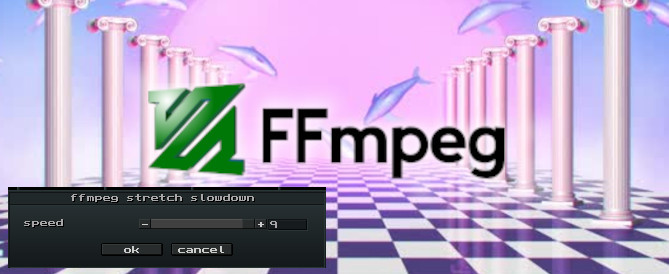
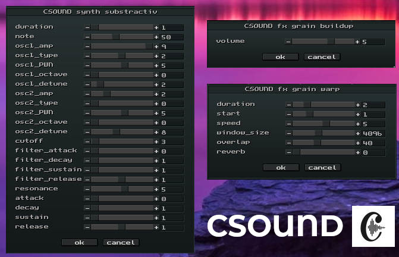

# MilkyTracker addons

<a href="samplers"></a>

<a href="ffmpeg"></a>

<a href="sox"></a>

<a href="csound"></a>

<a href="ladspa"></a>

<a href="random-sample"></a>

<a href="pd"></a>

## About addons

**Addons** allow for interfacing **with** the operating system ♥.<br>
This prevents milkytracker to become a monolyth DAW, stay small, and 
promote **personal computing** across all OS'es.<br>

Addons can be accessed via the sample-editor rightclick context-menu.<br>
Because *samples ARE key-ingredients* for sample-trackers, so an unexplored territory is to **integrate** external tools with the sampler (not filebrowsers):

* **procedural SAMPLERS**: sample **ANY** synth/app/input into milkytracker
* DIY '**plugin grabber**' by sampling desktop audio
* **generate** samples using puredata/csound etc
* **apply** a complex **effect** to a sample
* source samples from an online API
* source samples from an local AI agent
* Extend the sampler with your **favorite SCRIPTING LANGUAGE(s)** 
* Create script-**pipelines between different tools**
* **automate** tedious tasks 
* FUTURE: export/import `.xp` [processable] patterns in a similar fashion

Also async workflows are possible via the sample editor:

* right-click: Addon > select your addon (`audacity %s &` e.g.)
* import later: Addon > import from addon

## Rationale: parametric cli dialogs

MilkyTracker aims to be a small & portable musicproduction app.<br>
Becoming a multi-plugin-host is simply not on the table, as it would burden its 
mission with maintenance of various plugin-format (and break lowspec devices).<br>
Having that said, **parametric cli dialogs** combined with powerful cli-backends are a perfect match for  addons♥.


## Developer info

Developing addons is much easier compared to developing VST C++ plugins.<br>
You are encouraged to use **scriptable** DSP-backends instead:

* [ffmpeg](https://ffmpeg.org) (effect-filters, [aeval](https://ffmpeg.org/ffmpeg-filters.html#aeval) for processing, [aevalsrc](https://ffmpeg.org/ffmpeg-filters.html#aevalsrc) for synthesis)
* [SoX](https://sourceforge.net/projects/sox/) (effect-filters, synth for synthesis)
* [csound](https://csound.org) (insane DSP powerhouse for fx/synths with huge ecosystem)

> Milkytracker addons are **parametric cli dialogs**. Basically, it present a UI dialog, before executing the final cli-cmd:

```shell
sox %s -D %s speed %~(speed:1:20:1)
``` 

produces:


which produces:

```
sox /tmp/in.wav -D /tmp/out.wav speed 1
```

for more info see https://github.com/milkytracker/MilkyTracker/tree/master/src/tools/addons.txt

> please contribute and do a pullrequest, minimum contribution guidelines: 

* create a (topic/author-based) folder in this repo
* put your scripts in there
* and a `README.md`
* and a `screenshot.jpg`
* and a `addons.txt`
* done!

