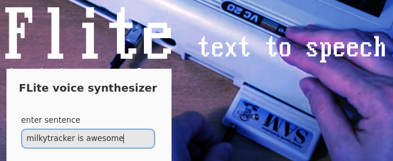

# Festival Lite Text2Speech Synth

[Flite](http://www.festvox.org/flite) can convert text to audio using different voices.

## Installation

> NOTE: tested on linux only 

1. Make sure flite + zenity or yad is installed (via your package manager nix/apt-get/homebrew)
2. Worstcase do a manual installation of [flite](http://www.festvox.org/flite) + [zenity](https://gitlab.gnome.org/GNOME/zenity) or [yad](https://github.com/v1cont/yad)
4. Doublecheck: make sure typing `flite` + (`yad` or `zenity`)in your console will work (or set [PATH](https://superuser.com/questions/284342/what-are-path-and-other-environment-variables-and-how-can-i-set-or-use-them))
5. copy/paste the contents of [addons.txt](./addons.txt) into milkytracker (`Sample Editor > addons > edit addons`) 
6. make sure to save the texteditor (ctrl+s or command+s)
7. profit! (now you should see the addons appear)

> for more debugging info run `ADDONS_DEBUG=1 ./milkytracker`

