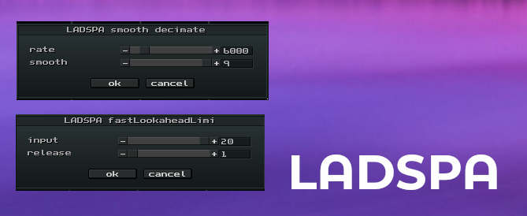

# LADSPA plugins

[LADSPA](https://en.wikipedia.org/wiki/LADSPA) plugins are simple but powerful FX processors [mostly found on linux].



## Installation

1. Make sure either [ffmpeg](https://ffmpeg.org) or [SoX](https://sourceforge.net/projects/sox/) is installed (via your package manager nix/apt-get/homebrew)
2. Worstcase do a [manual installation](https://sourceforge.net/projects/sox/)
3. Doublecheck: make sure typing `sox` or `ffmpeg` in your console will work (or set [PATH](https://superuser.com/questions/284342/what-are-path-and-other-environment-variables-and-how-can-i-set-or-use-them))
4. copy the 'ladspa' folder of this repository to the config-directory:

* LINUX/MAC: `~/.config/milkytracker`
* WINDOWS:   `C:\Users\<user>\AppData\Roaming\MilkyTracker`

5. copy/paste the contents of [addons.txt](./addons.txt) into milkytracker (`Sample Editor > addons > edit addons`) 
6. make sure to save the texteditor (ctrl+s or command+s)
7. profit! (now you should see the addons appear)

NOTE: the two ladspa-examples use plugins from the legendary [Steve Harris ladspa-plugins](https://github.com/swh/ladspa). They are available in most packagemanagers (ubuntu: `apt-get swh-plugins` e.g.)

> for more debugging info run `ADDONS_DEBUG=1 ./milkytracker`

## How do I add my favorite ladspa?

1. First open the ladspa in Tenacity (former Audacity)
2. Observe the number of parameters (2 e.g.)
3. Observe the labels of parameters ('gain' and 'cent' e.g.)
4. Observe the range/default values (`-60..0` and `0.0-0.9` e.g.)
5. Observe the name without `.so` extension (`multibandeq` e.g.)
5. write the sox- or ffmpeg- definition to `addons.txt`:

```
LADSPA myfavorite ; sox %s -D %s rate 44100 ladspa multibandeq -%~(rate:0:60:0) 0.%~(cent:0:9:9)

LADSPA myfavorite ; ffmpeg -y -hide_banner -i %s -af "ladspa=multibandeq_lib:multibandeq:-%~(rate:0:60:0)|0.%~(cent:0:9:9)" %s
```

> NOTE: sox is a bit more easy, in the sense that ffmpeg requires a (`.so`) libraryname:pluginname format.
