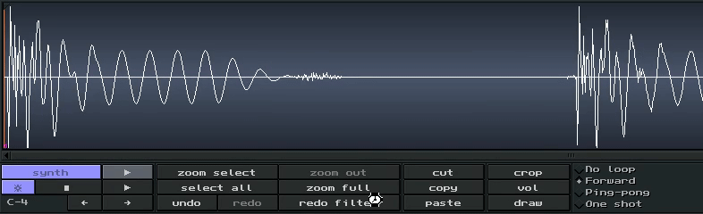

# Random samples 

Making music is about spending as least possible time in filebrowsers. 
This addon lets you randomly pick a sample from a folder.

> TIP: press 'redo-filter'-button in the sample-editor to pick another random sample (After having launched the addon once)

## Installation

1. copy the 'ladspa' folder of this repository to the config-directory:

* LINUX/MAC: `~/.config/milkytracker`
* WINDOWS:   `C:\Users\<user>\AppData\Roaming\MilkyTracker`

5. copy/paste the contents of [addons.txt](./addons.txt) into milkytracker (`Sample Editor > addons > edit addons`) 
6. make sure the sample-folder locations (like `random-sample/samples/2020`) are updated in `addons.txt`
7. make sure to save the texteditor (ctrl+s or command+s)
8. profit! (now you should see the addons appear)

The `sample.sample.ps1`-file is for windows, and `random.sample` for linux/mac. 

> TIP: modify the scripts to your liking! (you can duplicate them to `random.kick`, `random.hihat` e.g.)

## Linux/Mac

The `random.sample` is a bit more powerful, with extra options:

* multi-folder support: `./random.sample /tmp/out.wav /mnt/samplecd1 /mnt/samplecd2 ...` 
* keyword-search regex: `SEARCH='(kick|drum|hihat)' ./random.sample /mnt/samplecd1 /mnt/samplecd2 ...`
* creates an index (`.index` folder) for fast searching across slow network drives 
* re-index by prefixing env-var: `INDEX=1 ./random.sample ....`

Very powful stuff!
