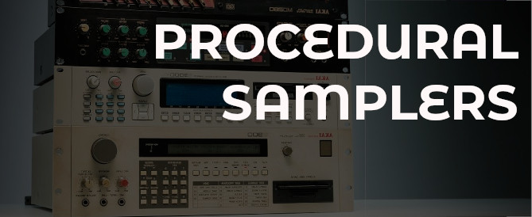

# Procedural Samplers 

Making music is about spending as least possible time in filebrowsers.<br>
Why limit ourselves with linear sampler workflows?



With procedural sampling, we can start imagining new and **personal** workflows.

## Installation

The default `addons.txt` of milkytracker already contains ways to sample from applications.

1. rightclick in the sample-editor: Addons > edit addons
2. you can comment out the ones which don't work for you/your platform

TIPS:

1. linux users probably want to have sox installed (manually or via package manager)
2. if you're on windows, uncomment the sox/waveaudio one

## Going procedural

Let's say you have other (online) software which create or process samples:

1. write your script (`AIgenvocal.py` or `AIprocess.py` e.g.)
2. make sure that it works (`AIgenvocal.py out.wav` or `AIprocess.py in.wav out.wav` e.g.4
3. add them to `addons.txt`

4. add this to the `addons.txt` file in the config-directory (Addons > edit addons):

* LINUX/MAC: `~/.config/milkytracker`
* WINDOWS:   `C:\Users\<user>\AppData\Roaming\MilkyTracker`

```
myprocedural sampler     ; ./AIgenvocal.py %s
myprocedural processor   ; ./AIprocess.py %s %s
myprocedural workflow    ; read -p "enter text: " text && ./AIgenvocal.py %s --text="$text"
```

5. make sure to save the texteditor (ctrl+s or command+s)
6. profit! (now you should see the addons appear)

> NOTE 2: if you dont want them to freeze the UI, add '&' and select 'Addon > import from addon' afterwards
> NOTE 2: for more debugging info run `ADDONS_DEBUG=1 ./milkytracker`

